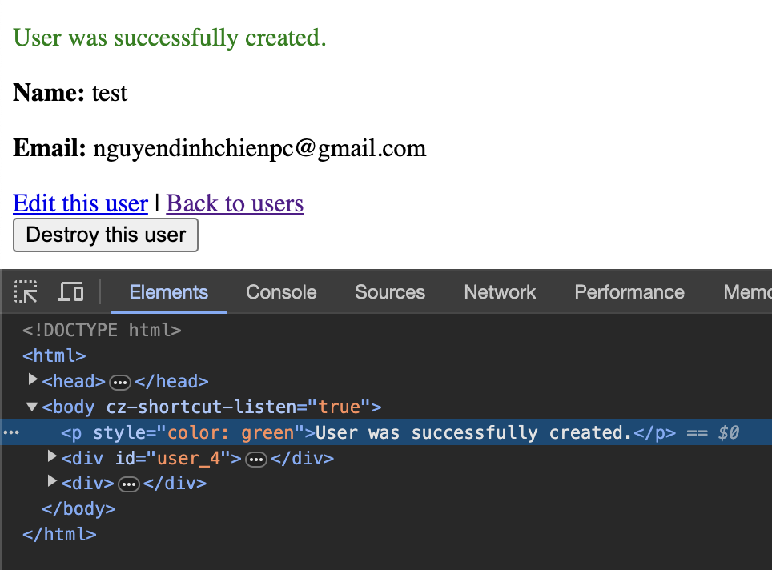
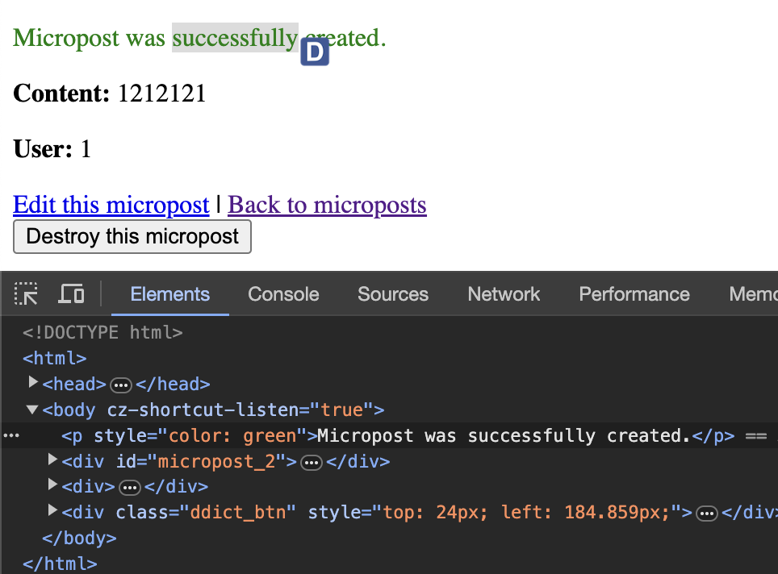
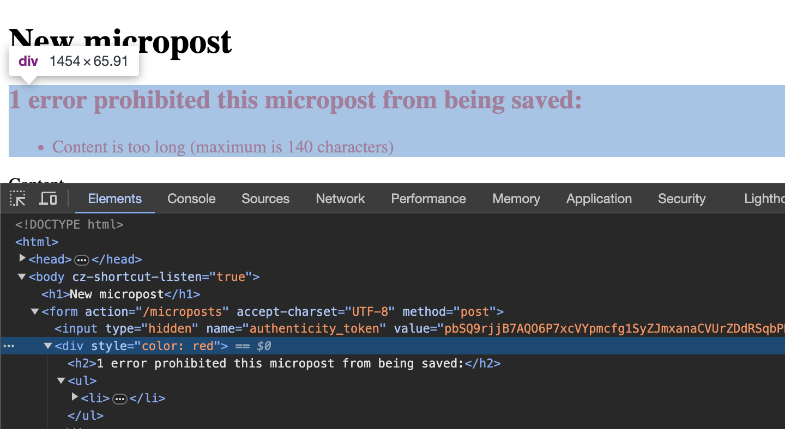

Exercises

** 1.2 ** 

1. According to the default Rails page, what is the version of Ruby on your
system? Confirm by running ruby -v at the command line

- The version of Ruby on my system is ruby 3.2.2.

2. What is the version of Rails? Confirm that it matches the version installed in Listing 1.2.

- The version of Rails on my system is Rails 7.1.2

** 1.3 ** 

1. Change the content of the hello action in Listing 1.9 to read “hola, mundo!” instead of “hello, world!”.

```
render html: "hola, mundo!"
```

2. Show that Rails supports non-ASCII characters by including an inverted
exclamation point, as in “¡Hola, mundo!” (Figure 1.18).14 To get a ¡
character on a Mac, you can use Option-1; otherwise, you can always
copy-and-paste the character into your editor.

```
render html: "¡Hola, mundo!"
```
3. By following the example of the hello action in Listing 1.9, add a second action called goodbye that renders the text “goodbye, world!”. Edit
the routes file from Listing 1.11 so that the root route goes to goodbye
instead of to hello (Figure 1.19).

```
render html: "goodbye, world"
```

router.rb
```
application#goodbye
```

** 1.4 **
Cant deploy to Heroku

** 1.5 **
Cant deploy to Heroku


** 2.1 **
1. (For readers who know CSS) Create a new user, then use your browser’s
HTML inspector to determine the CSS id for the text “User was successfully created.” What happens when you refresh your browser?
- There is no CSS ID for the text 'User was successfully created.'. When you refresh the browser, the text goes away.


2. What happens if you try to create a user with a name but no email address?
- When you try to create a user with a name but no email address, user the user is still being created normally.

3. What happens if you try create a user with an invalid email address, like "@example.com”?
- When you try to create a user with a name but no email address, user the user is still being created normally.

4. Destroy each of the users created in the previous exercises. Does Rails display a message by default when a user is destroyed?
- Rails displays "User was successfully destroyed." when a user is destroyed.

** 2.2 **
1. By referring to Figure 2.11, write out the analogous steps for visiting the URL /users/1/edit.

Step 1: The browser issues a request for the /users/1/edit URL.
Step 2: Rails routes /users/1/edit to the edit action in the Users controller.
Step 3: The edit action asks the User model to retrieve the user with an id of 1 (User.find(params[:id])).
Step 4: The User model pulls the specified user from the database.
Step 5: The User model returns the single users to the controller.
Step 6: The controller captures the user in the @user variable, which is passed to the edit view.
Step 7: The view uses embedded Ruby to render the page as HTML.
Step 8: The controller passes the HTML back to the browser.

2. Find the line in the scaffolding code that retrieves the user from the database in the previous exercise. Hint: It’s in a special location called set_user.

- Line: @user = User.find(params[:id]).

3. What is the name of the view file for the user edit page?

- edit.html.erb

** 2.3 **
1. (For readers who know CSS) Create a new micropost, then use your browser’s HTML inspector to determine the CSS id for the text“Micropost was successfully created.” What happens when you refresh you browser?

- There is no CSS ID for the text 'Micropost was successfully created.'. When you refresh the browser, the text goes away.


2. Try to create a micropost with empty content and no user id.

- Successfully create a micropost with empty content and no user id.

3. Try to create a micropost with over 140 characters of content (say, the
first paragraph from the Wikipedia article on Ruby).

- The micropost with the content length set to over 140 characters successfully creates.

4. Destroy the microposts from the previous exercises.

- Successfully destroy a micropost.

** 2.4 **

1. Try to create a micropost with the same long content used in a previous exercise (Section 2.3.1). How has the behavior changed?

- Creating a micropost fails and triggers a validation error if the content length exceeds 140 characters.


2. (For readers who know CSS) Use your browser’s HTML inspector to determine the CSS id of the error message produced by the previous exercise.

- There is no CSS ID for error message.


** 2.5 **

1. Edit the user show page to display the content of the user’s first micropost.
(Use your technical sophistication (Box 1.2) to guess the syntax based on
the other content in the file.) Confirm by visiting /users/1 that it worked.

```
<p>First Micropost</p>
<%= @user.microposts.first.content %>
```

2. The code in Listing 2.18 shows how to add a validation for the presence
of micropost content in order to ensure that microposts can’t be blank.
Verify that you get the behavior shown in Figure 2.17.

- The validation error message displayed "Content can't be blank."

3. Update Listing 2.19 by replacing FILL_IN with the appropriate code to
validate the presence of name and email attributes in the User model (Figure 2.18).

```
class User < ApplicationRecord
  has_many :microposts
  validates :name, presence: true
  validates :email, presence: true
end
```

** 2.6 **
1. By examining the contents of the Application controller file, find the
line that causes ApplicationController to inherit from ActionController::Base.

```
    class ApplicationController < ActionController::Base.
```

2. Is there an analogous file containing a line where ApplicationRecord
inherits from ActiveRecord::Base? Hint: It would probably be a file
called something like application_record.rb in the app/models
directory.

In app/models/application_record.rb:

```
class ApplicationRecord < ActiveRecord::Base
  primary_abstract_class
end
```

** 2.7 **
Cant deploy now

** 3.1. **
Can't deploy now

** 3.2. **
1. Generate a controller called Foo with actions bar and baz.

```
$ rails g controller FooController bar baz
```

2. By applying the techniques described in Box 3.1, destroy the Foo controller and its associated actions.

```
$ rails d controller FooController bar baz
```

** 3.3. **
1.Make a Contact page for the sample app.15 Following the model in Listing 3.16, first write a test for the existence of a page at the URL /static_pages/contact by testing for the title “Contact | Ruby on Rails Tutorial
Sample App”. Get your test to pass by following the same steps as when
making the About page in Section 3.3.3, including filling the Contact
page with the content from Listing 3.41.

- Code on folder /app/views/static_pages/contact.html.erb

** 4.2. **
1. Assign variables city and state to your current city and state of residence. (If residing outside the U.S., substitute the analogous quantities.)

```
>> city = 'Bac Ninh'
=> "Bac Ninh"
>> state = "Ha Noi"
=> "Ha Noi"
```

2. Using interpolation, print (using puts) a string consisting of the city and
state separated by a comma and a space, as in “Los Angeles, CA”.

```
puts "#{city}, #{state}"
```

3. Repeat the previous exercise but with the city and state separated by a tab
character.

```
puts "#{city}\t#{state}"
```
4. What is the result if you replace double quotes with single quotes in the
previous exercise?

- The result is '#{city}\t#{state}'

** 4.3. **

1. What is the length of the string “racecar”?

```
puts "racecar".length
7
=> nil
```

2. Confirm using the reverse method that the string in the previous exercise is the same when its letters are reversed.

```
puts "racecar".reverse
racecar
=> nil
```

3. Assign the string “racecar” to the variable s. Confirm using the comparison operator == that s and s.reverse are equal.

```
>> s = "racecar"
=> "racecar"
>> s == s.reverse
=> true
```

4. What is the result of running the code shown in Listing 4.9? How does it
change if you reassign the variable s to the string “onomatopoeia”? Hint:
Use up-arrow to retrieve and edit previous commands

```
>> s = "onomatopoeia"            
=> "onomatopoeia"
>> s == s.reverse    
=> false
```


** 4.4. **

1. By replacing FILL_IN with the appropriate comparison test shown in
Listing 4.10, define a method for testing palindromes. Hint: Use the
comparison shown in Listing 4.9.

```
def palindrome_tester(s)
 if s == s.reverse
    puts "It's a palindrome!"
 else
    puts "It's not a palindrome."
 end
end
```

2. By running your palindrome tester on “racecar” and “onomatopoeia”,
confirm that the first is a palindrome and the second isn’t.

```
>> palindrome_tester("racecar")
It's a palindrome!
=> nil
>> palindrome_tester("onomatopoeia")
It's not a palindrome.
=> nil
```

3. By calling the nil? method on palindrome_tester("racecar"),
confirm that its return value is nil (i.e., calling nil? on the result of the
method should return true). This is because the code in Listing 4.10
prints its responses instead of returning them.

```
>> palindrome_tester("racecar").nil?
=> true
```

** 4.5. **

1. Assign a to be to the result of splitting the string “A man, a plan, a canal,
Panama” on comma-space.

```
>> a = "A man, a plan, a canal, Panama"
=> "A man, a plan, a canal, Panama"
>> a = a.split(', ')
=> ["A man", "a plan", "a canal", "Panama"]
```

2. Assign s to the string resulting from joining a on nothing.

```
>> a.join()
=> "A mana plana canalPanama"
```

3. Split s on whitespace and rejoin on nothing. Use the palindrome test from Listing 4.10 to confirm that the resulting string s is not a palindrome by the current definition. Using the downcase method, show that s.downcase is a palindrome.

```
>> s = a.join
=> "A mana plana canalPanama"
>> s = s.split.join
=> "AmanaplanacanalPanama"
>> s == s.reverse
=> false
>> s.downcase == s.reverse.downcase
=> true
```

4. What is the result of selecting element 7 from the range of letters a through z? What about the same range reversed? Hint: both cases you will have to convert the range to an array.

```
>> ('a'..'z').to_a[7]        
=> "h"
>> ('a'..'z').to_a.reverse[7]
=> "s"
```

** 4.6. **

1. Using the range 0..16, print out the first 17 powers of 2.

```
>> (0..16).each do |num|
>>   puts  num*num
>>   puts  '--'
>> end
0
--
1
--
4
--
9
...
256
--
=> 0..16

```
2. Define a method called yeller that takes in an array of characters and
returns a string with an ALLCAPS version of the input. Verify that yeller(['o', 'l', 'd']) returns "OLD". Hint: Combine map, upcase, and join.

```
>> def yeller(char_arr)
>>   char_arr.map(&:upcase).join
>> end
=> :yeller
>> yeller(['o', 'l', 'd'])
=> "OLD"
```

3. Define a method called random_subdomain that returns a randomly
generated string of eight letters.

```
>> def random_subdomain
>>   ('a'..'z').to_a.sample(8).join
>> end
=> :random_subdomain
>> random_subdomain
=> "eawumzpk"
```

4. By replacing the question marks in Listing 4.12 with the appropriate
methods, combine split, shuffle, and join to write a function that
shuffles the letters in a given string.

```
>> def string_shuffle(s)
>>  s.split('').shuffle.join
>> end

=> string_shuffle("foobar")
```

** 4.7. **

1. Define a hash with the keys 'one', 'two', and 'three', and the values 'uno', 'dos', and 'tres'. Iterate over the hash, and for each key/value pair print out "'#{key}' in Spanish is '#{value}'".

```
>> hash.each do |key,value|
>>  puts "#{key} in Spanish is #{value}"
>> end
one in Spanish is uno
two in Spanish is dos
three in Spanish is tres
```

2. Create three hashes called person1, person2, and person3, with first and last names under the keys :first and :last. Then create a params hash so that params[:father] is person1, params[:mother] is person2, and params[:child] is person3.
Verify that, for example, params[:father][:first] has the right value.

```
>> person1 = {"first_name": "Chien", "last_name": "Nguyen Dinh"}
=> {:first_name=>"Chien", :last_name=>"Nguyen Dinh"}
>> person2 = {"first_name": "Chien", "last_name": "ND"}
=> {:first_name=>"Chien", :last_name=>"ND"}
>> person3 = {"first_name": "Chien", "last_name": "Nguyen"}
=> {:first_name=>"Chien", :last_name=>"Nguyen"}
>> params = {father: person1, mother: person2, child: person3}
=> 
{:father=>{:first_name=>"Chien", :last_name=>"Nguyen Dinh"},
...
>> params[:father][:first_name]
=> "Chien"
```

3. Define a hash with symbol keys corresponding to name, email, and a
“password digest”, and values equal to your name, your email address,
and a random string of 16 lower-case letters.

```
>> user_data = { name: "Your Name", email:"your.email@example.com", password_digest: SecureRandom.hex(8) }
=> {:name=>"Your Name", :email=>"your.email@example.com", :password_digest=>"58332c0fe14d04e1"}
```

4. Find an online version of the Ruby API and read about the Hash method merge. What is the value of the following expression?

```
>> { "a" => 100, "b" => 200 }.merge({ "b" => 300 })
=> {"a"=>100, "b"=>300}
```

